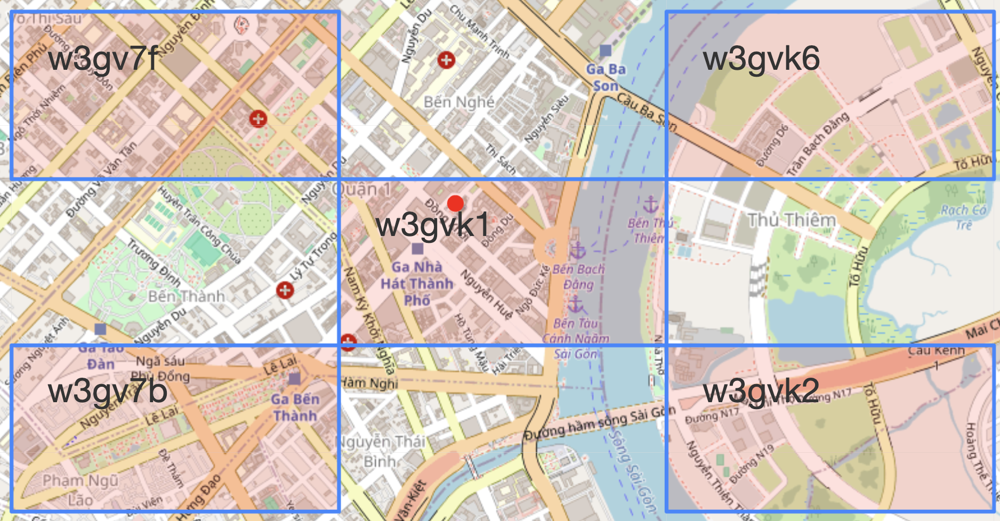
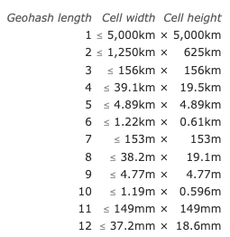

# Geo Hashing

## What is GeoHash ?

- A Geohash is a **unique identifier** of a specific region on the Earth.
- The basic idea is the Earth gets divided into rectangular regions of user-defined size, and each region is assigned a unique id which is called its **Geohash**.
- For a given location on earth, the algorithm converts an arbitrary precision latitude and longitude into a string, and the regions with a **similar string prefix** will be **closer together**.
  - Conceptually, GeoHashing **reduces proximity search** to _string prefix matching_. As each character encodes additional precision, shared prefixes denote geographic proximity.
  <p align="center"><br>The demo of GeoHash "w3gvk1" corresponding to the longitude & latitude of the HCMC Opera House (Red dot) and the neighbors with precision=6 such as "w3gv7f", "w3gv7b", etc. with the same prefix in geohashes</p>
- Geohashes also provide a degree of **anonymity** since it isn’t necessary to expose exact GPS coordinates. The location of an entity up to a bounding box cell at a given precision is all that is known.

## Algorithm

- The user specifies a level of precision, usually between 1 and 12, and a GeoHash of that length is returned.
- The GeoHash symbol map consists of 32 characters: consists of digits 0 thru 9 plus all lowercase letters excluding a, i, l, o.
  - `base32 = "0123456789bcdefghjkmnpqrstuvwxyz"`
- Generate the geohash using `pygeohash` package

```Python
import pygeohash
lat, lon, precision = 10.776775578390142, 106.7031296241205, 6
gh_center = pygeohash.encode(latitude=lat, longitude=lon, precision=precision)
print(gh_center) # 'w3gvk1'
```

- As you can see, with `precision=6`, the geohash returned is also with the `length=6`
- The table below gives the dimensions of GeoHash cells at each level of precision (taken from [here](https://www.movable-type.co.uk/scripts/geohash.html)):

 <p align="center"><br>The cell sizes of geohashes of different lengths</p>
