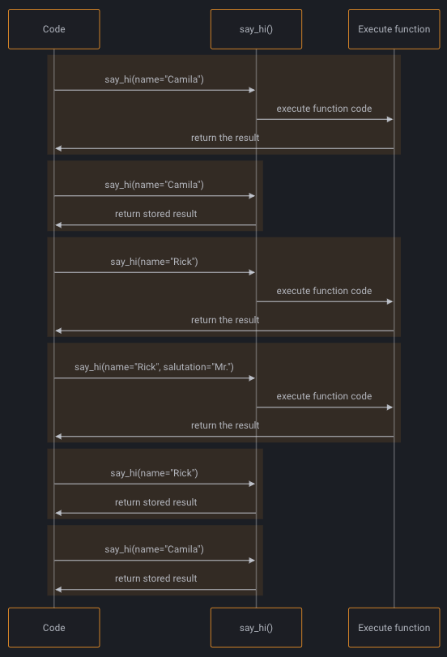

# 2024

## Day 2

- How to express $10^{n}$: `2.944297e+10` is equivalent to `2.944297*(10**10)`

## Day 1

### Matplotlib

- Modify the x-axis with highlighted values (only), instead of listing down all the dates
  - In the below example, instead of putting in x-axis all the months, we just highlight data points with marks a year from 1949 to 1962

```Python
fig, ax = plt.subplots()

ax.plot(df['Month'], df['Passengers'])
ax.set_xlabel('Date')
ax.set_ylabel('Number of air passengers')

plt.xticks(np.arange(0, 145, 12),   # only provide each 12 months
           np.arange(1949, 1962, 1) # a list of a year corresponding to
)
```

### Pandas

#### `.loc` vs `.iloc`

- `loc` gets rows (and/or columns) with particular **labels**.
- `iloc` gets rows (and/or columns) at **integer locations**.
- Example: given the following dataframe that has the index starting from 80 to 84

```Python
df = pd.DataFrame(np.arange(25).reshape(5, 5),
                      index=[80, 81, 82, 83, 84],
                      columns=['col_A','col_B','col_C', 'col_D', 'col_E'])
```

|     | col_A | col_B | col_C | col_D | col_E |
| --: | ----: | ----: | ----: | ----: | ----: |
|  80 |     0 |     1 |     2 |     3 |     4 |
|  81 |     5 |     6 |     7 |     8 |     9 |
|  82 |    10 |    11 |    12 |    13 |    14 |
|  83 |    15 |    16 |    17 |    18 |    19 |
|  84 |    20 |    21 |    22 |    23 |    24 |

- Return the first row of the df with two columns `col_A` and `col_D`
  - `.loc`: since the first row in the dataframe corresponding to the `index=80`, so we need to specify it in the `.loc`
    - `df.loc[80, ["col_A", "col_D"]]`
  - `.iloc`: as iloc will be based on the integer location, so the first row in the df is corresponding to the location 0
    - `df.iloc[0, [df.columns.get_loc(c) for c in ["col_A", "col_D"]]]`

```Python
# example of .loc and .iloc to return the first row of the df with two columns A and D
df.loc[80, ["col_A", "col_D"]]
# col_A    0
# col_D    3
df.iloc[0, [df.columns.get_loc(c) for c in ["col_A", "col_D"]]]
# col_A    0
# col_D    3
```

- Select last 2 row in the `df` &#8594; `.iloc` will have the advantages as it is based on the integer location rather then the labels.

```Python
df.iloc[-2:, :]
```

|     | col_A | col_B | col_C | col_D | col_E |
| --: | ----: | ----: | ----: | ----: | ----: |
|  83 |    15 |    16 |    17 |    18 |    19 |
|  84 |    20 |    21 |    22 |    23 |    24 |

- Select first 3 columns of the row after index=82

```Python
df.iloc[df.index.get_loc(82):, :3]
```

|     | col_A | col_B | col_C |
| --: | ----: | ----: | ----: |
|  82 |    10 |    11 |    12 |
|  83 |    15 |    16 |    17 |
|  84 |    20 |    21 |    22 |

# 2023

## Day 11

### Python

- `1e-4` is equal to `0.0001` with total 4 zeros
- Validate the input string variable, say `split` belongs to certain options: `assert split in ['train', 'test', 'both']`
  - We can add the handling path if the assertion error paused the program
  ```Python
  try:
      assert 'value' not in numerical_vars
  except AssertionError:
      # do something
  ```

### Pandas

#### `pd.melt` vs contingency table (`pd.crosstab`)

- The `melt` function in pandas is used to unpivot a DataFrame, meaning that it **converts columns of data into rows**.
  - This is useful when you want to combine the data for plotting
  - For example: the melt function has converted the `Math` and `Physics` columns into rows, and created two new columns: `subject` and `score`.

```Python
# Create a sample DataFrame
df = pd.DataFrame({'student_id': [1, 2, 3], 'Math': [4, 5, 6], 'Physics': [7, 8, 9]})

# Melt the DataFrame
df_melted = df.melt(id_vars=['student_id'], value_vars=['Math', 'Physics'], var_name='Ssubject', value_name='score')

# Print the melted DataFrame
print(df_melted)

#    student_id subject  score
# 0       1      Math      4
# 1       2      Math      5
# 2       3      Math      6
# 3       1      Physics   7
# 4       2      Physics   8
# 5       3      Physics   9

# plotting the melted dataframe by subject using hue of seaborn

sns.barplot(df_melted, x='student_id', y='score', hue='subject')
```

- The `crosstab` function: produces a DataFrame where the rows represent the levels of one factor and the columns represent the levels of another factor.
- Usage: to create frequency table for each category in a feature vs another feature
- The crosstab function takes the following arguments:
  - `index`: The name of the column to use for the row labels.
  - `columns`: The name of the column to use for the column labels.
  - `values`: The name of the column to use for the cell values. If not specified, the counts of observations are used.
  - `margins`: If True, the DataFrame will include a row and column for the totals.

```Python
# Create a sample DataFrame
df = pd.DataFrame({'gender': ['M', 'F', 'M', 'F', 'F'], 'favorite_color': ['blue', 'red', 'green', 'blue', 'purple']})

#     gender favorite_color
# 0      M           blue
# 1      F            red
# 2      M          green
# 3      F           blue
# 4      F         purple
# Create a crosstabulation of gender and favorite color
crosstab = pd.crosstab(df['gender'], # rows
                       df['favorite_color'],  # columns
                       margins=True # True to calculate the total
                       )

# re-name columns "All" to 'row_totals' & 'col_totals'
# note: columns "All" are only avail if margins=True
crosstab.columns = [*crosstab.columns.to_list()[:-1], 'row_totals']
crosstab.index = [*crosstab.index.to_list()[:-1], 'col_totals']
#             blue  green  purple  red  row_totals
# F              1      0       1    1           3
# M              1      1       0    0           2
# col_totals     2      1       1    1           5
```

### Matplotlib

- Subplots:

```Python
# Annual, weekly and daily seasonality
# ==============================================================================
fig, axs = plt.subplots(2, 2, figsize=(8.5, 5.5), sharex=False, sharey=True)

# Before:
ax1 = axs[0,0]
ax2 = axs[0,1]
# After with axs.ravel()
axs = axs.ravel()
ax1 = axs[0]
#...
ax4 = axs[3]

```

### Conda vs Pip: Package Availability

- Pip installs packages from the Python Package Index (`PyPI`), which hosts a vast array of Python libraries. Almost any Python library can be installed using pip.
- conda installs packages from the Anaconda distribution and other channels (`conda-forge`). While the number of packages available through conda is smaller than pip, conda can install packages for multiple languages and not just Python.
- Example: `skforecast` is not avail in the `conda-forge` but it is avail in `PyPI`, so you cannot `conda install skforecast`, but it can be install via `pip install` command

## Day 10

### Pandas

- Find the row with the column is equal to value: `index_choice = df.index.get_loc(CustomerId=15674932)`

#### `pd.cut` vs `pd.qcut`

|           | Space between 2 bins | Frequency of Samples in each bin |
| --------- | -------------------- | -------------------------------- |
| `pd.cut`  | Equal Spacing        | Difference                       |
| `pd.qcut` | Un-equal Spacing     | Same                             |

- `pd.cut` will choose the bins to be **evenly spaced** according to the values themselves and not the frequency of those values.
  - You also can define the bounds for each binning with `pd.cut()`
  - You can use the Fisher-Jenks algorithm to determine the natural bounds and then pass those values into `pd.cut()`
- `pd.qcut` the bin interval will be chosen so based on the percentiles that you have the same number of records in each bin.

```Python
factors = np.random.randn(30)

pd.cut(factors, 5).value_counts() # bin size has equal interval of ~1

# (-2.583, -1.539]    5
# (-1.539, -0.5]      5
# (-0.5, 0.539]       9
# (0.539, 1.578]      9
# (1.578, 2.617]      2

pd.qcut(factors, 5).value_counts() # each bin has equal size of 6

# [-2.578, -0.829]    6
# (-0.829, -0.36]     6
# (-0.36, 0.366]      6
# (0.366, 0.868]      6
# (0.868, 2.617]      6


```

#### `.read_csv()` by chunk

- If the csv file is large, can consider to read by chunk

```Python
df_iter = pd.read_csv(file_path, iterator=True, chunksize=100000)
df = next(df_iter)
```

### Python

#### `lru_cache` from `functools`

- `@lru_cache` modifies the function it decorates to return the same value that was returned the first time, instead of computing it again, executing the code of the function every time.

```Python
@lru_cache
def say_hi(name: str, salutation: str = "Ms."):
    return f"Hello {salutation} {name}"
```

<p align="center"></p>

#### typing `Annotated`

- `Annotated` in python allows developers to declare the type of a reference and provide additional information related to it.

```Python
from typing_extensions import Annotated
# This tells that "name" is of type "str" and that "name[0]" is a capital letter.
name = Annotated[str, "first letter is capital"]
```

- Fast API examples:
  ```Python
  from fastapi import Query
  def read_items(q: Annotated[str, Query(max_length=50)])
  ```
  - The parameter `q` is of type `str` with a maximum length of 50.

#### Float to Decimal conversion

- Convert `float` directly to `Decimal` constructor introduces a rounding error.

```Python
from decimal import Decimal
x = 0.1234
Decimal(x)
# Decimal('0.12339999999999999580335696691690827719867229461669921875')
```

- **Solution**: to convert a float to a string before passing it to the constructor.
  - You also can round the float before converting it to string

```Python
Decimal(str(x))
# Decimal('0.1234')
Decimal(str(round(x,2)))
# Decimal('0.12')
```

-

## Day 9

### `subprocess` module

- `subprocess.run` is a higher-level wrapper around Popen that is intended to be more convenient to use.
  - Usage: to run a command and capture its output
- `subprocess.call`
  - Usage: to run a command and check the return code, but do not need to capture the output.
- `subprocess.Popen` is a lower-level interface to running subprocesses

  - Usage: if you need more control over the process, such as interacting with its input and output streams.

- A `PIPE` is a unidirectional communication channel that connects one process's standard output to another's standard input.

```Python
# creates a pipe that connects the output of the `ls` command to the input of the `grep` command,
ls_process = subprocess.Popen(["ls"], stdout=subprocess.PIPE, text=True)

grep_process = subprocess.Popen(["grep", ".ipynb"], stdin=ls_process.stdout, stdout=subprocess.PIPE, text=True)

output, error = grep_process.communicate()

print(f"Ouptut:\n{output}")
print(f"Error : {error}")

# Ouptut:
# google_colab_tutorial.ipynb
# subprocess.ipynb
#
# Error : None
result = subprocess.run(["ls"], stdout=subprocess.PIPE)

print(result.stdout.decode()) # decode() to convert from bytes to strings
# google_colab_tutorial.ipynb
# subprocess.ipynb
```

#### `subprocess` vs `os.system`

- `subprocess.run` is generally more flexible than `os.system` (you can get the stdout, stderr, the "real" status code, better error handling, etc.)
- Even the [documentation for `os.system`](https://docs.python.org/3/library/os.html#os.system) recommends using subprocess instead.

### `sys` module

- The kernel knows to execute this script with a **python** interpreter with the shebang `#!/usr/bin/env python`
- `sys.argv[0]` return name of the script
- `sys.argv[1:]` return the arguments parsed to the script

```Python
#############################
# in the python_script.py   #
#############################
#!/usr/bin/env python
import sys
for arg in reversed(sys.argv[1:]):
    print(arg)

#############################
# in the interactive shell  #
#############################
bash-5.2$ chmod +x python_script.py
bash-5.2$ ./python_script.py a b c
# Running: ./python_script.py
# c
# b
# a
```

## Day 8

- `bytes("yes", "utf-8")` convert string to binary objects:

### Matplotlib

- Color Map

```Python
cmap = plt.get_cmap("viridis")
fig = plt.figure(figsize=(8, 6))
m1 = plt.scatter(X_train, y_train, color=cmap(0.9), s=10)
m2 = plt.scatter(X_test, y_test, color=cmap(0.5), s=10)
```

- Plot 2 charts on the same figure with share x-axis

```Python
fig, ax1 = plt.subplots()

ax1.hist(housing["housing_median_age"], bins=50)

ax2 = ax1.twinx()  # key: create a twin axis that shares the same x-axis
color = "blue"
ax2.plot(ages, rbf1, color=color, label="gamma = 0.10")
ax2.tick_params(axis='y', labelcolor=color)
ax2.set_ylabel("Age similarity", color=color) # second y-axis's measurement

plt.show()
```

### Relative import

```
# example.py
from .abstract import ExampleClass
# if we run this script directly like python src/abc/example.py, we will encounter the issue
```

- Soluton: `python -m src.abc.example` or call the `example.py` script outside the `src`

### `subprocess.Popen` to send Linux command

```Python
from subprocess import Popen, Pipe

execute = Popen("scp -i /location_in_machine_A/to/private/key -v -P 64022 file_path machineB@ip_address:/path/to/store/inB/".split(), stdout=PIPE, stdin=PIPE, stderr=PIPE)
execute.stdin.write(bytes("yes", "utf-8")) # to send the "yes" command
execute.communicate()[0]

```

### `os.path`

- To read the path separator of the env `os.path.sep # return '/' if using Linux`

### List

- Copy a list: `copied_list = a_list[:]`
  - Leverage on `copy` module
  ```Python
  import copy
  copied_list = copy.deepcopy(a_list)
  ```

## Day 7

### Conda

- Conda is an open source **package** + **environment** manager
- Conda vs (Miniconda & Anaconda):
  - _Conda_ is a **package manager** & _Conda_ is tightly coupled to two software distributions: _Anaconda_ and _Miniconda_.
  - _Anaconda_ is a full distribution of the central software in the PyData ecosystem, and includes Python itself along with binaries for several hundred third-party open-source projects.
  - _Miniconda_ is essentially an installer for an empty conda environment, containing only Conda and its dependencies, so that you can install what you need from scratch.
- Recommended conda installation in PC: Miniconda
- Miniconda and Miniforge:
  - **Miniforge**-installed conda is the same as Miniconda-installed conda, except that it uses the conda-forge channel (and only the conda-forge channel) as the default channel.
  - **Miniconda**-installed conda is the Anaconda (company) driven minimalistic conda installer, where pacakages installed from the anaconda channels
- Conda channel: A **channel** is the location where packages are stored remotely.
  - Example of channels: Anaconda channel, `conda-forge`, Apple
  - Install TensorFlow dependencies from Apple Conda channel: `conda install -c apple tensorflow-deps`
- Understanding `environment.yml` in `conda create --prefix ./venv python=3.8 --file environment.yml`
  - `tensorflow-deps` will need to be installed by `conda` via `apple` channel
  - `scikit-learn` will be installed by `conda` via `conda-forge` channel
  - `tensorflow-macos` will need `pip` install via **PyPI**

```yaml
name: tensorflow
channels:
  - apple
  - conda-forge
dependencies:
  - tensorflow-deps
  - scikit-learn
  - pip:
      - tensorflow-macos
      - tensorflow-metal
```

#### Conda env creation:

```shell
# create env
conda create --prefix ./venv python=3.8 --file requirements.txt
conda activate ./venv
conda deactivate

# install package from requirements.txt
conda install --file requirements.txt
# export to requirements.txt so that can install via pip in virtualenv/venv environment

pip list --format=freeze > requirements.txt
```

#### `conda create --file requirements.txt` vs `conda env create --file environment.yml`

- `conda create --file` expects a `requirements.txt`, not an `environment.yml`, each line in the given file is treated as a package-reference
- `conda env create` to create an environment from a given `environment.yml`
  - Command: `conda env create --name tensorflow --file environment.yml`

#### Other common conda commands

- `conda env list` to list down conda envs
- `du -h -s $(conda info --base)/envs/*` list down the size of each env
- `conda config --show channels` to show available channels in the config

## Day 6

- Number: `1000000` can be written as `1_000_000` for the ease of visualisation
  ```Python
  state['Population'] / 1_000_000
  ```

### Matplotlib

- Plot horizontal line: `{plt, ax}.axhline(y=0.5, color='r', linestyle='-')`

### Numpy

- Stacking columns/rows
  - `np.column_stack` & `np.row_stack`
  - `np.hstack` & `np.vstack`

```Python
a = np.array((1,2,3))
b = np.array((2,3,4))
# column stack
np.column_stack((a,b))
# array([[1, 2],
#       [2, 3],
#       [3, 4]])

# row_stack or vstack
np.row_stack((a,b))
np.vstack((a,b))
# array([[1, 2, 3],
#        [2, 3, 4]])

# hstack
np.hstack((a,b))
# array([1, 2, 3, 2, 3, 4])
```

### Holidays package

- Pandas's holiday package: `pandas.tseries.holiday`
- `holidays` package

### Code Refactor

- Instead of `if '.yml' in file_path or '.yaml' in file_path` we can do as follows:
  - Solution: `if any(ext in file_path for ext in ['.yml', '.yaml']`

## Day 5

### Seaborn

- To get color palatte `color_pal = sns.color_palette()`

#### Histogram (Displot)

- Since the `sns.displot` is deprecated, so we will use `sns.histplot` as follow to plot the histogram + kde distribution by specifying `kde=True`
- Also can `set_xlim()` to the zone that containing the data in case the distribution is skewed

```Python
sns.histplot(df['col_name'], kde=True, bins=50).set_xlim(0,8);
```

#### Pairplot

- Pairplot is to use `scatterplot()` for each pairing of the variables and `histplot()` for the marginal plots along the diagonal
- Customise with `x_var` and `y_var` and `hue`

```Python
sns.pairplot(df.dropna(),
             hue='hour',
             x_vars=['hour','dayofweek',
                     'year','weekofyear'],
             y_vars='PJME_MW',
             height=5,
             plot_kws={'alpha':0.15, 'linewidth':1.5}
            )
plt.suptitle('Power Use MW by Hour, Day of Week, Year and Week of Year')
plt.show()
```

<p align="center"></p>

### Python

- `yield` keyword is used in the context of defining generator functions.
  - When a generator function is called, it doesn't execute the function immediately.
  - Instead, it returns a generator object that can be used to control the execution of the function.
  - The code inside the generator function is executed only when an item is requested from the generator using the `next()` function or a `for` loop.

```Python
def simple_generator():
    yield 1
    yield 2
    yield 3

# Create a generator object
gen = simple_generator()

# using next() to access the code inside
print(next(gen)) # 1
print(next(gen)) # 2
print(next(gen)) # 3
print(next(gen)) # StopIteration raised

# using for-loop to iterate through the generator
for value in simple_generator():
    print(value)

```

### Pandas

### Select columns based on Dtype

- Numerical columns: `num_cols = df.select_dtypes(include=np.number).columns.tolist()`
- Categorical columns: `cat_cols = df.select_dtypes(exclude=np.number).columns.tolist()`

### Time-series

- Convert the datetime index to a datetime col: `df['date'] = df.index.date`
- Slicing using 1 date by including `23:59:59`

```Python
end_train = '1980-01-01 23:59:59'
# including 23:59:59 means
data_train = df.loc[:end_train] # ends at 1980-01-01
data_test  = df.loc[end_train:] # start at 1980-01-02
```

#### `df.query`

- Can set multiple condition: `df.query("make == 'bmw' and model == '1_series')`
- Can query using a list

```Python
holiday_list = ['2021-01-01', '2022-09-02']
df.query('datetime_col in @holiday_list')
```

#### Check & Remove Duplicates

- `df.duplicated()` to check if there are any row duplicate. This will return `True` for the 2nd occurence of the duplicate
  - `df.duplicated(subset=['col_A','col_B','col_C'])` in case there is no entire row duplciate, we can check duplicates for only subsets of columns
- `df.query("make == 'bmw' and model == '1_series' and year == 2013 and price == 31500")` using query to identify & view the duplicated rows
- Remove the duplicates
  - `.reset_index(drop=True)` to reset the index after dropping the duplicates
  - `.copy()` to make the deep copy of the dataframe

```Python
df = df.loc[~df.duplicated(subset=['Coaster_Name','Location','Opening_Date'])] \
    .reset_index(drop=True).copy()
```

### Matplotlib

- You can set matplotlib object to `ax` variable
  - You also can continue to plot on the same graph with `ax` variable

```Python
# case 1: get ax from the plot via pandas dataframe
ax = df['year'].value_counts() \
    .head(10) \
    .plot(kind='bar', title='Top 10 Years Coasters Introduced')

# case 1.1: also can continue to plot on the same graph with ax variable
df.query('year < 2023').plot(style='.', ax=ax)

ax.set_xlabel('year')
ax.set_ylabel('count')

# case 2: get ax from the plot via seaborn
ax = sns.countplot(data=df, x='year')
ax.set_xticks(ax.get_xticks(), ax.get_xticklabels(), rotation=90, ha='center')
```

- Rotate the xticks label

```Python
# rotate via plt
plt.xticks(rotation=90)

# rotate via ax
ax.set_xticks(ax.get_xticks(), ax.get_xticklabels(), rotation=45, ha='right')
```

## Day 4

### Numpy

- Numpy 's `np.nan` vs Python 's `None` object
  - In Numpy, a `np.nan` value is a native floating-point type array.
    - When you try to do some arithmetic operations will `np.nan`, the result will always be `np.nan`.
    - Fortunately, Numpy provides some special aggregation methods that can ignore the existence of `np.nan` value such as `np.nansum(arr)`
  - `None` is a Python Object called **NoneType**
    - Pandas automatically converts the `None` to a `np.nan` value.
    - If you try to aggregate over this array, you will get an error because of the NoneType.

### Pandas

- `df.loc[:, "col"] = df["col"].map(mapping)` re-assign the updated value to originial column without any error
- `pd.options.display.max_columns` to view all the columns in the df when `df.head()`

#### `groupby`

- Use the `.agg` function to get multiple statistics on the other columns

```Python
## Example 1:
df.groupby('A').agg(['min', 'max']) # apply same operations on other columns
## Example 2:
df.groupby('A').agg({'B': ['min', 'max'], 'C': 'sum'}) # apply different operations on other columns
## Example 3:
# group by Team & Position, get mean, min, and max value of Age for each value of Team.
grouped_single = df.groupby(['Team', 'Position']).agg({'Age': ['mean', 'min', 'max']})
grouped_single.columns = ['age_mean', 'age_min', 'age_max'] # rename columns
# reset index to get grouped columns back
grouped_single = grouped_single.reset_index()

## Example 4:
df_customers.groupby('rfm_score').agg(    # groupby 'rfm_score' col
    customers=('customer_id', 'count'),   # create new 'customers' col by count('customer_id' col)
    mean_recency=('recency', 'mean'),     # create new 'mean_recency' col by mean('recency' col)
    mean_frequency=('frequency', 'mean'),
    mean_monetary=('monetary', 'mean'),
).sort_values(by='rfm_score')
```

- Group by the first column and get second column as lists in rows using `.apply(list)`

```Python
In [1]: df = pd.DataFrame( {'a':['A','A','B','B','B','C'], 'b':[1,2,5,5,4,6]})
        df

Out[1]:
   a  b
0  A  1
1  A  2
2  B  5
3  B  5
4  B  4
5  C  6

In [2]: df.groupby('a')['b'].apply(list)
Out[2]:
a
A       [1, 2]
B    [5, 5, 4]
C          [6]
Name: b, dtype: object
```

### Python

- `IPython` debug: when executing `main.py` script in the terminal, we still can insert **ipython** checkpoint at the line we want to debug
  - `from IPython import embed; embed()`
- Avoid circular imports

  ```
  # __init__.py of utils folder
  from .base_logger import *
  from .data_loader import *

  def load_yaml()

  # data_loader.py
  from utils import load_yaml # this will cause circular import
  ```

  - Solution: DO NOT `from .data_loader import *` if a data_loader refer to any functions in `utils.__init__.py`

### `.env`

- Installation: `pip install python-dotenv==1.0.0`
- Config file stores in `.env` file

```shell
HUGGINGFACEHUB_API_TOKEN="<hf_token>"
```

- Load environmental variables

```Python
import os
from dotenv import load_dotenv, find_dotenv

load_dotenv("../config/.env")
# load_dotenv(find_dotenv()) # find_dotenv() is to find the .env
os.environ["HUGGINGFACEHUB_API_TOKEN"] = ... # insert your API_TOKEN here
```

## Day 3

### Notebook

- Surpass the warning

```Python
import warnings
warnings.filterwarnings('ignore')

# [Optional] If you do not want to supress all the warnings, you also can explicitly specify which warning needs ignore
import warnings
warnings.filterwarnings('ignore', category=FutureWarning)
warnings.filterwarnings('ignore', category=DeprecationWarning)
```

- Both `!` and `%` allow you to run shell commands from a Jupyter notebook
  - Difference: `!` calls out to a shell (in a new process), while `%` affects the process associated with the notebook
    - `!cd foo`, by itself, has **no lasting effect**, since the process with the changed directory immediately terminates.
    - `%cd foo` changes the current directory of the notebook process, which is a **lasting effect**.
  - Example
  ```Bash
  # in a notebook cell
  !git clone https://github.com/full-stack-deep-learning/fsdl-text-recognizer-2021-labs # ! can use for git clone, pip install
  %cd fsdl-text-recognizer-2021-labs                                                    # % use for cd
  ```

### VScode

- Multiline editing in Visual Studio Code:
  - Mac: `⌥ Opt`+`⌘ Cmd`+`↑/↓`
  - Windows: `Shift`+`Alt`+`↑/↓`

### Matplotlib

#### Figure

- Figure object is the overall window where everything is drawn.

```Python
def draw_smtg():
  fig = plt.figure(figsize=(10,10))
  plt.plot(...)

  return fig #whatever the graphs in fig will be returned
```

### Python

- Logging level: `DEBUG > INFO > WARNING > ERROR > CRITICAL`
  - If set `logging.basicConfig(level=logging.ERROR)` means that only log `ERROR` & `CRITICAL`
- `reload` a module in Jupyter notebook

```Python
from importlib import reload
from abc import module_a
# By doing this, whatever code change in class_xyz will be reflected in the notebook
reload(module_a)
from abc.module_a import class_xyz
```

- `python -m pip install <some-package>`
  - [`-m` flag](https://stackoverflow.com/a/69527909/7973510) makes sure that you are using the pip that's tied to the active Python executable.
- Load pickle file using `joblib`

```Python
model = joblib.load('lgbm_mode.pkl')
```

## Day 2

### Pandas

- `df = pd.read_csv('example.csv',index_col=[0], parse_dates=[0])` to set the col loc=0 as the index, and parsed as date time type
- `to_csv` to prevent `nnamed: 0` column to be appended along with your original df by set `df.to_csv('result.csv', index=False)`
- `.apply` based on the condition of certain columns

```Python
df.loc[:,'C'] = df.apply(lambda row: 'Hi' if row['A'] > 10 and row['B'] < 5 else '')
```

- `df.insert()` Avoid error `Try using .loc[row_indexer,col_indexer] ` when creating the new column in df from an existing df

```Python
# insert(position of the newly_inserted_col in the df, newly_inserted_col's name, newly_inserted_col's value)
data.insert(len(data.columns), 'rolling', data['open'].rolling(5).mean().values)
```

#### Joining Pandas DataFrame with Numpy array

- Concat `df` with `numpy_array` and assign the name for the `numpy_array` as `new_col`
  - Syntax: `df = df.assign(new_col=numpy_array)`

#### Joining Pandas DataFrame with Pandas Series

```Python
# need to convert pd's Series into the Dataframe, and transpose it before concat with pd's DF
pd.concat([df, pd_series.to_frame().T], ignore_index=True)
```

#### Joining Pandas DataFrames

- Experience: before joining (either `concat`, `merge`), need to careful about the _index_ of the dataframes (might need to `.reset_index()`) as apart from the joining condition, pandas also matching the index of each dataframe.

<p align="center"><br>Column Concat<br>
<br>
Merge [Inner, Outter (Left, Right)]
</p>

- `concat()` for combining DataFrames across rows or columns
  - **axis** represents the axis that you’ll concatenate along.
    - The default value is **0**, which concatenates **along the index**, or row axis.
    - Alternatively, a value of **1** will concatenate vertically, **along columns**. You can also use the string values "index" or "columns".
  - `ignore_index` defaults to False.
    - If True, then the new combined dataset won’t preserve the original index values in the axis specified in the axis parameter. This lets you have entirely new index values.
- `merge()` for combining data on common columns or indices
  - **how** defaults to `inner`, but other possible options include `outer`, `left`, and `right`
  - `on`; `left_on` and `right_on` specify a column or index that’s present only in the left or right object that you’re merging

```Python
# ------------ pd.concat() examples ------------
reindexed = pd.concat(
     [df1, df2], ignore_index=True, axis=1
)
# ------------ pd.merge() examples -------------
pd.merge(
     df1, df2, how="left", on=["col_A", "col_B"]
)
# if left & right DF has diff joining col names
pd.merge(
     df1, df2, how="left", left_on=["col_A1"], right_on=["col_A2"]
)
```

### Numpy

- Dense & Sparse Matrix Conversion:
  - Sparse &#8594; Dense: `A.toarray()`
- Numpy vs Tensor:
  - TensorFlow seems to look a lot like NumPy. But here’s something NumPy can’t do: retrieve the gradient of any differentiable expression with respect to any of its inputs.
    - Open a `GradientTape` scope, apply some computation to one or several input tensors, and retrieve the gradient of the result with respect to the inputs.
  - A significant difference between NumPy arrays and TensorFlow tensors is that TensorFlow tensors aren’t assignable: they’re constant

```Python
import numpy as np
x = np.ones(shape=(2, 2))
x[0, 0] = 0.

x = tf.ones(shape=(2, 2))
x[0, 0] = 0. # ERROR: fail, as a tensor isn’t assignable.
```

### `sys.path`

- `sys.path` is a built-in variable within the sys module. It contains a list of directories that the interpreter will search in for the required module. When a module(a module is a python file) is imported within a Python file, the interpreter first searches for the specified module among its built-in modules. If not found it looks through the list of directories(a directory is a folder that contains related modules) defined by sys.path.
- To locate the installation path of the module: `print(module_name.__file__)`
- Python will locate the module based on the path appears first in `sys.path`, so in order to change prioritise the installation packages, we can do as follow:

```Python
import sys
sys.path.insert(0, '/path/to/site-packages') # location of src
```

### Matplotlib

- Set params: `plt.rcParams.update({'font.size': 14})`
- Set the style of the plot `plt.style.use('fivethirtyeight') # set at the front of the notebook`
  - Other styles: `seaborn-v0_8-darkgrid`

#### Ax

- Set vertical axis range: `ax.set_ylim([0,1])` or `plt.gca().set_ylim(0,1) #set vertical range to [0-1]`
- Set horizontal axis range:

#### Subplots

- Enable subplots share the same axis with `sharex` or `sharey`: `plt.subplots(nrows=3, sharey=True)`
- `fig.tight_layout(pad=2)` function of matplotlib allows to adhust the gap between subplots
  - `pad` parameter to specify gap size

### Python

- `assert`: to check if the data is expected (`assert len(x.shape) == 2`) and will raise Exception if not matching.
- `iter()`: return an iterator for the given a list, set, tuple or object with `__next__()` method.

```Python
phones = ['apple', 'samsung', 'oneplus']
phones_iter = iter(phones)
print(next(phones_iter))
```

- `os.environ[variable]=value` a mapping object that represents the user’s environmental variables.
- `sys.path` is a built-in variable within the sys module. It contains a list of directories that the interpreter will search in for the required module. When a module(a module is a python file) is imported within a Python file, the interpreter first searches for the specified module among its built-in modules. If not found it looks through the list of directories(a directory is a folder that contains related modules) defined by sys.path.
- `random` module
  - Randomly select an item in a list: `random.randint(0, len_x)`
  - Randomly select subset of items in a list:
  ```Python
  # Method 1
  indices_permutation = random.permutation(len(x))
  dataset[indices_permutation][:10]
  # Method 2: select 10 out of the dataset
  indices_permutation = random.sample(range(len(trainset)), 10)
  dataset[indices_permutation]
  ```
  - Normal distribution with mean 0 and standard deviation 1: `np.random.normal(size=(3,1), loc=0., scale=1.)`
  - Uniform distribution between 0 and 1: ` np.random.uniform(size=(3, 1), low=0., high=1.)`

## Day 1

### VS Code

#### VS Code Shortcuts

- `CMD + Shift + P` Command Palette
- `CMD + P` Quickly open files

#### Auto Venv Activation

```json
# in .vscode settings.json
"python.terminal.activateEnvironment": true
```

## Code Formatter & Linting

- The main coding standard for Python is PEP8 (Python Enhancement Proposal 8)
  - **Linters** such as `flake8` and `pylint` highlight places where your code doesn’t conform with PEP8.
  - **Automatic formatters** such as `black` that will update your code automatically to conform with coding standards.
  - **Type Checker** `mypy` is a static type checker for Python. Type checkers help ensure that you're using variables and functions in your code correctly. With mypy, add type hints (PEP 484) to your Python programs, and mypy will warn you when you use those types incorrectly.

### Setup inside VS Code

- How to install `flack8`:
  - Step 1: Install `black` in virtual environment: `pip install flake8`
  - Step 2: Open the Command Palette (`CMD + Shift + P`) &#8594; Search the “Python: Select Linter” and press enter. Select the “flake8”
- How to install `black`:
  - Step 1: Install `black` in virtual environment: `pip install black`
  - Step 2: Open the Command Palette (`CMD + Shift + P`) &#8594; “Preferences &#8594; Settings”
    - Search “format on save” and check the checkbox
    - Search “python formatting provider” and select the `black`.
  - NOTE: can run black seperately `black -l 80 --preview src/youtube_statistics.py`
- How to install `isort`:
  - Open the Command Palette (`CMD + Shift + P`). Search the “Preferences: Open User Settings (JSON)” and press enter. It will open the “settings.json” and add the follow code into that:
  ```json
  "editor.codeActionsOnSave": {
    "source.organizeImports": true
  }
  ```

### Setup pre-commit using `git hooks`

This is to ensure the code formatter, linting is running before the commit

- install requirements-dev dependencies

```sh
# requirements-dev.txt
flake8
black
mypy
coverage
```

- add `hooksPath` into git config core: `git config --local core.hooksPath .git/hooks/`
- `pre-commit` file inside `.git/hooks/`
  ```sh
  # content inside pre-commit file
  echo "Running lint.sh before commit"
  bash lint.sh
  echo "Linting completed"
  ```
  - make pre-commit file executable via `chmod +x .git/hooks//pre-commit`
- Define the content in `lint.sh`

  ```sh
  # content inside lint.sh
    linting_path="."
    echo "-------------Formatter with black-----------------"
    black $linting_path --line-length=88

    echo "-------------Linting with flake8-----------------"
    flake8 $linting_path --max-line-length=88 --ignore=E203,W503,E231,E266,E722

    echo "-------------Type checking with mypy-----------------"
    mypy $linting_path  --ignore-missing-imports
  ```

### Setup pre-commit using `pre-commit` package

- [Reading](https://medium.com/@anton-k./how-to-set-up-pre-commit-hooks-with-python-2b512290436)
