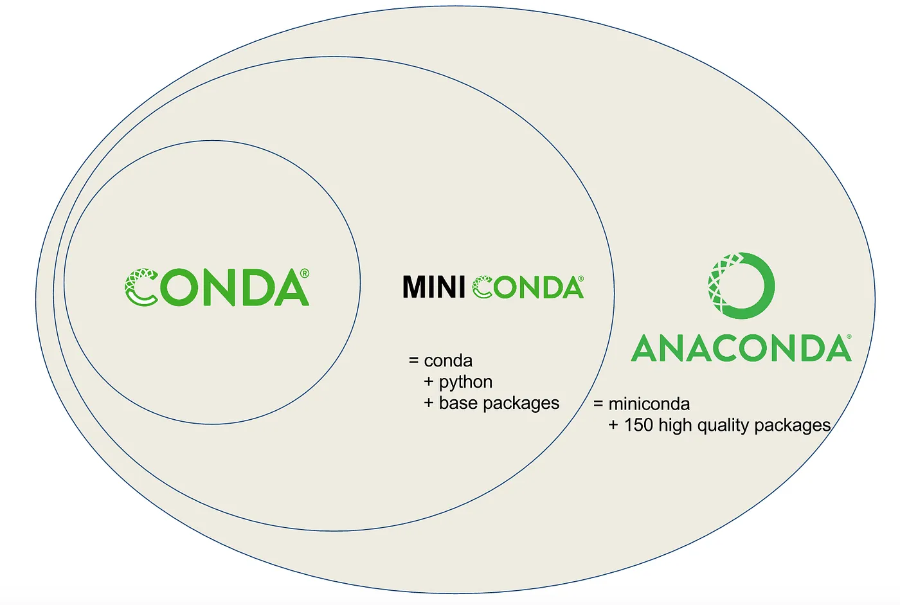

# Conda

## What is Conda ?

- Conda is an open source **package** + **environment** management system that runs on Windows, Mac OS and Linux.
  - Conda as a _package manager_ helps you find and install packages.
  - If you need a package that requires a different version of Python, you do not need to switch to a different environment manager, because Conda is also an _environment manager_.
- Conda was created for Python programs, Conda can package and distribute software for any language such as R, Ruby, Lua, Scala, Java, JavaScript, C, C++, FORTRAN

### Pip vs Conda

- **Pip** is the Python Packaging Authority’s recommended tool for installing packages from the Python Package Index (PyPI).
  - Pip installs Python software packaged as _wheels_ or _source_ distributions.

#### Difference between Conda and Pip

- Pip installs Python packages whereas Conda installs packages which may contain software written in any language.
- Conda has the ability to create **isolated environments** that can contain different versions of Python and/or the packages installed in them.
  - This can be extremely useful when working with data science tools as different tools may contain conflicting requirements which could prevent them all being installed into a single environment.
- Pip has no built in support for environments but rather depends on other tools like `virtualenv`, `venv` to create isolated environments.
- When installing packages, pip installs dependencies in a _recursive_, serial loop.
  - In contrast, conda uses a _satisfiability (SAT)_ solver to verify that all requirements of all packages installed in an environment are met. This check can take extra time but helps prevent the creation of broken environments.

|                     | Conda                                                | Pip                            |
| ------------------- | ---------------------------------------------------- | ------------------------------ |
| Package             | pre-built, binary (faster)                           | wheels or source distributions |
| Package Source      | Anaconda Cloud (can use pip if package is not avail) | PyPI                           |
| Package Languages   | Any                                                  | Python only                    |
| Require compiled    | No                                                   | Yes                            |
| Create isolated env | built-in                                             | `virtualenv`, `venv`           |
| Dependency Check    | Yes                                                  | No                             |

### Conda vs Miniconda vs Anaconda

- Conda
- [Miniconda](https://docs.conda.io/projects/miniconda/en/latest/) = Conda + Python 3 + Base Packages
- Anaconda = Miniconda + High Quality Packages
<p align="center"></p>

- **Rule of thumbs**: installing Miniconda which combines Conda with Python 3
  - If needs a particular version of the full Anaconda distribution you can always create an new conda environment with following command

```shell
conda create --name anaconda-env-202302 anaconda=2023.02
```

### Miniconda and Miniforge

- `miniforge` is the **community** (`conda-forge`) driven minimalistic conda installer. Subsequent package installations come thus from conda-forge channel.
- `miniconda` is the **Anaconda** (company) driven minimalistic conda installer. Subsequent package installations come from the **anaconda channels** (default or otherwise).
- Summary: Miniforge-installed conda is the same as Miniconda-installed conda, except that it uses the conda-forge channel (and only the conda-forge channel) as the default channel.

### Conda Channel

- A **channel** is the location where packages are stored remotely.
- To Check the default channels: `conda config --show channels`
- To Install a Package in Conda Using a Channel Name: `conda install -c conda-forge matplotlib`
  - This is to install `matplotlib` via `conda-forge` channel

## Why should you use Conda ?

- Conda provides **pre-built** packages or binaries (which generally avoids the need to deal with compiling packages from source).
  - TensorFlow is an example of a tool which is difficult to install source (particularly with GPU support), but that can be installed using Conda in a single step.
- Conda is cross platform, with support for Windows, MacOS, GNU/Linux, and support for multiple hardware platforms, such as x86 and Power 8 and 9.
- Where a library or tools is not already packaged for install using conda, Conda allows for using other package management tools (such as pip) inside Conda environments.
- Conda can quickly install commonly used data science libraries and tools, such as R, NumPy, SciPy, Scikit-learn, Dask, TensorFlow, PyTorch, Fast.ai, NVIDIA RAPIDS, and more built using optimized, hardware specific libraries (such as Intel’s MKL or NVIDIA’s CUDA), which provides a speedup without having to change any of your code.

## Setup Conda on Macbook M2

- Download [Miniforge3 (Conda installer)](https://github.com/conda-forge/miniforge), namely [Miniforge3-MacOSX-arm64.sh](https://github.com/conda-forge/miniforge/releases/latest/download/Miniforge3-MacOSX-arm64.sh), for macOS arm64 chips (M1, M1 Pro, M1 Max)
- Install Miniforge3 into home directory
  - Installation Path: `/users/<id>/miniforge3`
  - Run `conda init` (conda init code will be added to .zshrc)
  - Restart Terminal

### Config

- Conda config will be stored in `~/.condarc`
- Show env name, instead of the entire path to env:
  - `conda config --set env_prompt '({name})'`
  - This above command is equivalent to add `env_prompt: '({name})'` to `.condarc`
- **Bug 1**: [environment duplication](https://github.com/microsoft/vscode-python/issues/22233?fbclid=IwAR1RimJUIENwStVLCyxOQLSWXsXdCK3aO5PYgSD9-N9i9ewXMwIIMx-vTtY) when open VS code terminal, conda init will be auto init the base env, and then after that VS code will activate the specific env of the project causing the terminal will have two env, say `(venv) (base) folder`
  - _Solution_: disable the auto_activate_base env in `.condarc` with the follow commands
    - `conda config --set auto_activate_base False`

```shell
chmod +x ~/Downloads/Miniforge3-MacOSX-arm64.sh
sh ~/Downloads/Miniforge3-MacOSX-arm64.sh
source ~/miniforge3/bin/activate
```

- Verify installation: `conda info`

## Conda commands

- List all existing environments: `conda env list`

### Create environments

#### Method 1

```shell
conda create --name env-name --file environment.yml
conda activate env-name
conda deactivate
```

- The environments created by Conda is always located in `/users/<id>/miniforge3/envs/`

#### Method 2: custom env location (preferred)

```shell
conda create --prefix ./venv python=3.8 --file environment.yml
conda activate ./venv
conda deactivate
```

#### `environment.yml`

- `tensorflow-deps` will need to be installed by `conda` via `apple` channel
- `scikit-learn` will be installed by `conda` via `conda-forge` channel
- `tensorflow-macos` will need `pip` install via **PyPI**

```yaml
name: tensorflow
channels:
  - apple
  - conda-forge
dependencies:
  - tensorflow-deps
  - scikit-learn
  - pip:
      - tensorflow-macos
      - tensorflow-metal
```

#### Tensorflow Setup MacOS M2

- Create env:

```shell
conda create --prefix ./venv python=3.10
conda activate ./venv
```

- Install TensorFlow dependencies from Apple Conda channel

```shell
conda install -c apple tensorflow-deps
```

- Install TensorFlow Base (Apple's fork of TensorFlow is called tensorflow-macos)

```shell
python -m pip install tensorflow-macos
```

- Install Apple's `tensorflow-metal` to leverage Apple Metal (Apple's GPU framework) for M1, M1 Pro, M1 Max GPU acceleration.

```shell
python -m pip install tensorflow-metal
```
