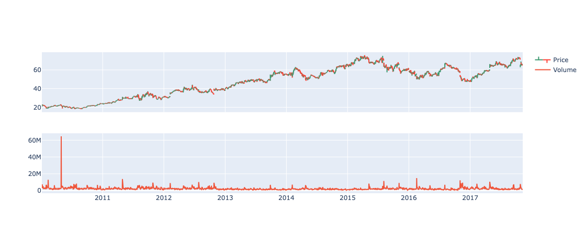

# Plotly

## Installation

```Python
pip install plotly
```

## Plotly Express

- Plotly Express is a high-level interface for creating various types of plots easily.

```Python
import plotly.express as px
fig = px.bar(x=["a", "b", "c"], y=[1, 3, 2])
fig.show()
```

## Plotly Graph Objects

### Single Plot

```Python
import plotly.graph_objects as go

# define the fig object
fig = go.Figure()
# add multiple line into the fig object
fig.add_trace(go.Scatter(x=data_train.index, y=data_train['users'], mode='lines', name='Train'))
fig.add_trace(go.Scatter(x=data_val.index, y=data_val['users'], mode='lines', name='Validation'))
fig.add_trace(go.Scatter(x=data_test.index, y=data_test['users'], mode='lines', name='Test'))
fig.update_layout(
    title  = 'Number of users',
    xaxis_title="Time",
    yaxis_title="Users",
    legend_title="Partition:",
    width=800,
    height=350,
    margin=dict(l=20, r=20, t=35, b=20),
    legend=dict(
        orientation="h",
        yanchor="top",
        y=1,
        xanchor="left",
        x=0.001
    )
)
#fig.update_xaxes(rangeslider_visible=True)
fig.show()
```

### Subplots

- `make_subplots` function from `plotly.subplots` is to create the subplots.

```Python
import plotly.graph_objs as go
from plotly.subplots import make_subplots

# Define the range for cropping the x-axis
start_date = '2021-01-10'
end_date = '2021-01-20'

# Create subplots
# shared_xaxes=True to help crop both plots at the same time.
fig = make_subplots(rows=2, cols=1, shared_xaxes=True)

# Add OHLC plot at row=1, col=1
fig.add_trace(
    go.Ohlc(
        x=df["Date"],
        open=df["Open"],high=df["High"],low=df["Low"],close=df["Close"],
        name="Price"
    ),
    row=1, col=1 # specify the plot order row=1, col=1
)

# Add Volume scatter plot at row=2, col=1
fig.add_trace(
    go.Scatter(
        x=df["Date"], y=df["Volume"],
        name="Volume"
    ),
    row=2, col=1 # specify the plot order row=2, col=1
)

# Update x-axes range
fig.update_xaxes(range=[start_date, end_date])

# Hide the rangeslider
fig.update(layout_xaxis_rangeslider_visible=False)

fig.show()
```

<p align="center"></p>
